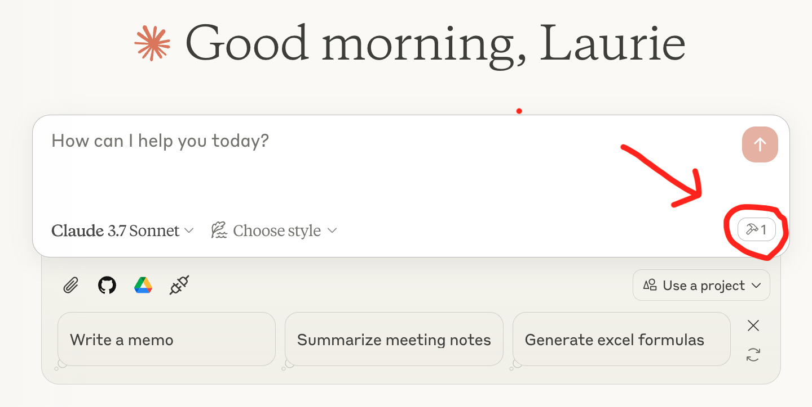

# LlamaCloud as an MCP server

To provide a local MCP server that can be used by a client like Claude Desktop, you can use `mcp-server.py`. You can use this to provide a tool that will use RAG to provide Claude with up-to-the-second private information that it can use to answer questions. You can provide as many of these tools as you want.

## Set up your LlamaCloud index

1. Get a [LlamaCloud](https://cloud.llamaindex.ai/) account
2. [Create a new index](https://docs.cloud.llamaindex.ai/llamacloud/guides/ui) with any data source you want. In our case we used [Google Drive](https://docs.cloud.llamaindex.ai/llamacloud/integrations/data_sources/google_drive) and provided a subset of the LlamaIndex documentation as a source. You could also upload documents directly to the index if you just want to test it out.
3. Get an API key from the [LlamaCloud UI](https://cloud.llamaindex.ai/)

## Set up your MCP server

1. Clone this repository
2. Create a `.env` file and add two environment variables:
    - `LLAMA_CLOUD_API_KEY` - The API key you got in the previous step
    - `OPENAI_API_KEY` - An OpenAI API key. This is used to power the RAG query. You can use [any other LLM](https://docs.llamaindex.ai/en/stable/understanding/using_llms/using_llms/) if you don't want to use OpenAI.

## Configure Claude Desktop

1. Install [Claude Desktop](https://claude.ai/download)
2. In the menu bar choose `Claude` -> `Settings` -> `Developer` -> `Edit Config`. This will show up a config file that you can edit in your preferred text editor.
3. You'll want your config to look something like this (make sure to replace `$YOURPATH` with the path to the repository):

```json
{
    "mcpServers": {
        "llama_index_docs_server": {
            "command": "poetry",
            "args": [
                "--directory",
                "$YOURPATH/llamacloud-mcp",
                "run",
                "python",
				"$YOURPATH/llamacloud-mcp/mcp-server.py"
            ]
        }
    }
}
```

Make sure to **restart Claude Desktop** after configuring the file. 

Now you're ready to query! You should see a tool icon with your server listed underneath the query box in Claude Desktop, like this:



