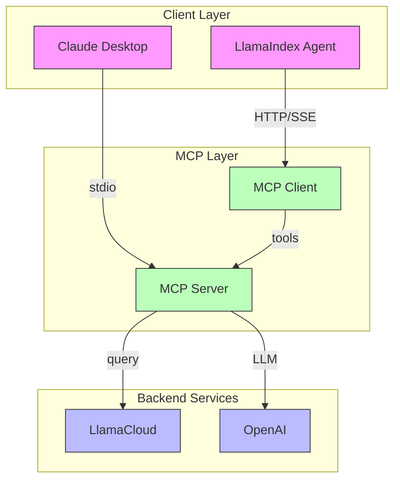

# LlamaIndex MCP demos

This repo demonstrates both how to create an MCP server using LlamaCloud and how to use LlamaIndex as an MCP client.

## Architecture

This project follows a well-documented architecture with detailed Architectural Decision Records (ADRs). Here's a high-level overview of the system:

For a comprehensive guide on building your own custom MCP server, check out our [detailed blog post](docs/blog.md).



### Architectural Decision Records (ADRs)

The following ADRs document key architectural decisions:

1. [ADR-0001: Using LlamaCloud as an MCP Server](docs/adrs/0001-llamacloud-mcp-server.md)
2. [ADR-0002: MCP Client Implementation](docs/adrs/0002-mcp-client-implementation.md)
3. [ADR-0003: Transport Protocol Selection](docs/adrs/0003-transport-protocol.md)
4. [ADR-0004: Cross-Platform Build and Validation Strategy](docs/adrs/0004-build-and-validation.md)
5. [ADR-0005: Custom MCP Server Development](docs/adrs/0005-custom-mcp-server.md)

## LlamaCloud as an MCP server

To provide a local MCP server that can be used by a client like Claude Desktop, you can use `mcp-server.py`. You can use this to provide a tool that will use RAG to provide Claude with up-to-the-second private information that it can use to answer questions. You can provide as many of these tools as you want.

### Set up your LlamaCloud index

1. Get a [LlamaCloud](https://cloud.llamaindex.ai/) account
2. [Create a new index](https://docs.cloud.llamaindex.ai/llamacloud/guides/ui) with any data source you want. In our case we used [Google Drive](https://docs.cloud.llamaindex.ai/llamacloud/integrations/data_sources/google_drive) and provided a subset of the LlamaIndex documentation as a source. You could also upload documents directly to the index if you just want to test it out.
3. Get an API key from the [LlamaCloud UI](https://cloud.llamaindex.ai/)

### Set up your MCP server

1. Clone this repository
2. Create a `.env` file and add two environment variables:
    - `LLAMA_CLOUD_API_KEY` - The API key you got in the previous step
    - `OPENAI_API_KEY` - An OpenAI API key. This is used to power the RAG query. You can use [any other LLM](https://docs.llamaindex.ai/en/stable/understanding/using_llms/using_llms/) if you don't want to use OpenAI.

Now let's look at the code. First you instantiate an MCP server:

```python
mcp = FastMCP('llama-index-server')
```

Then you define your tool using the `@mcp.tool()` decorator:

```python
@mcp.tool()
def llama_index_documentation(query: str) -> str:
    """Search the llama-index documentation for the given query."""

    index = LlamaCloudIndex(
        name="mcp-demo-2",
        project_name="Rando project",
        organization_id="e793a802-cb91-4e6a-bd49-61d0ba2ac5f9",
        api_key=os.getenv("LLAMA_CLOUD_API_KEY"),
    )

    response = index.as_query_engine().query(query + " Be verbose and include code examples.")

    return str(response)
```

Here our tool is called `llama_index_documentation`; it instantiates a LlamaCloud index called `mcp-demo-2` and then uses it as a query engine to answer the query, including some extra instructions in the prompt. You'll get instructions on how to set up your LlamaCloud index in the next section.

Finally, you run the server:

```python
if __name__ == "__main__":
    mcp.run(transport="stdio")
```

Note the `stdio` transport, used for communicating to Claude Desktop.


### Configure Claude Desktop

1. Install [Claude Desktop](https://claude.ai/download)
2. In the menu bar choose `Claude` -> `Settings` -> `Developer` -> `Edit Config`. This will show up a config file that you can edit in your preferred text editor.
3. You'll want your config to look something like this (make sure to replace `$YOURPATH` with the path to the repository):

```json
{
    "mcpServers": {
        "llama_index_docs_server": {
            "command": "poetry",
            "args": [
                "--directory",
                "$YOURPATH/llamacloud-mcp",
                "run",
                "python",
                "$YOURPATH/llamacloud-mcp/mcp-server.py"
            ]
        }
    }
}
```

Make sure to **restart Claude Desktop** after configuring the file. 

Now you're ready to query! You should see a tool icon with your server listed underneath the query box in Claude Desktop, like this:


## LlamaIndex as an MCP client

LlamaIndex also has an MCP client integration, meaning you can turn any MCP server into a set of tools that can be used by an agent. You can see this in `mcp-client.py`, where we use the `BasicMCPClient` to connect to our local MCP server.

For simplicity of demo, we are using the same MCP server we just set up above. Ordinarily, you would not use MCP to connect LlamaCloud to a LlamaIndex agent, you would use [QueryEngineTool](https://docs.llamaindex.ai/en/stable/examples/agent/openai_agent_with_query_engine/) and pass it directly to the agent.

### Set up your MCP server

To provide a local MCP server that can be used by an HTTP client, we need to slightly modify `mcp-server.py` to use the `run_sse_async` method instead of `run`. You can find this in `mcp-http-server.py`.

```python
mcp = FastMCP('llama-index-server',port=8000)

asyncio.run(mcp.run_sse_async())
```

### Get your tools from the MCP server

```python
mcp_client = BasicMCPClient("http://localhost:8000/sse")
mcp_tool_spec = McpToolSpec(
    client=mcp_client,
    # Optional: Filter the tools by name
    # allowed_tools=["tool1", "tool2"],
)

tools = mcp_tool_spec.to_tool_list()
```

### Create an agent and ask a question

```python
llm = OpenAI(model="gpt-4o-mini")

agent = FunctionAgent(
    tools=tools,
    llm=llm,
    system_prompt="You are an agent that knows how to build agents in LlamaIndex.",
)

async def run_agent():
    response = await agent.run("How do I instantiate an agent in LlamaIndex?")
    print(response)

if __name__ == "__main__":
    asyncio.run(run_agent())
```

You're all set! You can now use the agent to answer questions from your LlamaCloud index.
