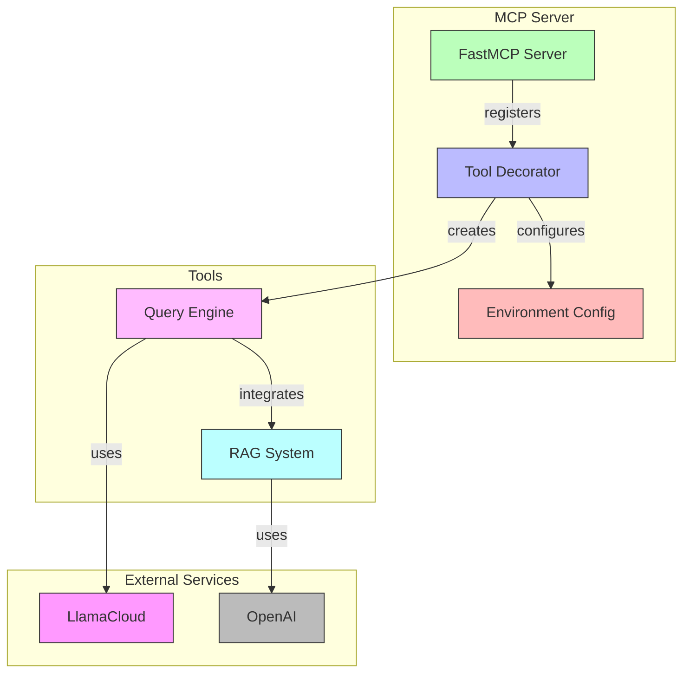
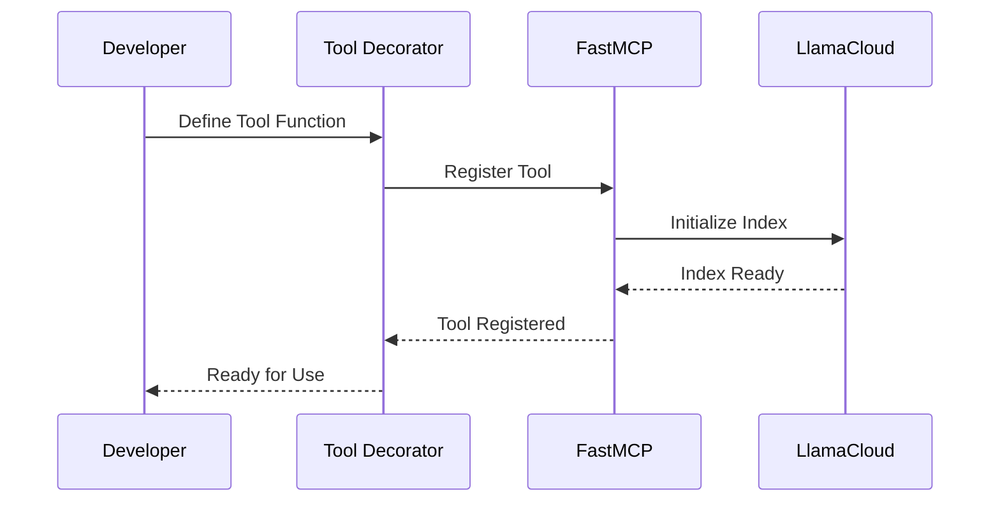

# [ADR-0001] Using LlamaCloud as an MCP Server

## Status

Accepted

## Context

The project requires a way to provide AI-powered tools to Claude Desktop and other clients that can consume Machine Callable Programs (MCPs). The system needs to:
- Provide real-time access to private documentation and data
- Support RAG (Retrieval Augmented Generation) capabilities
- Be easily extensible with new tools
- Support multiple transport protocols (stdio, HTTP)
- Be secure and maintainable

## Architecture Diagrams

### Server Component Architecture

### Tool Registration Flow

## Decision

We have decided to use LlamaCloud as the foundation for our MCP server implementation with the following key components:

1. FastMCP Server:
   - Using the `FastMCP` class for server implementation
   - Supporting both stdio (for Claude Desktop) and HTTP/SSE transport protocols
   - Providing a clean decorator-based API for tool registration

2. LlamaCloud Integration:
   - Using `LlamaCloudIndex` for document indexing and retrieval
   - Leveraging LlamaCloud's managed infrastructure for scalability
   - Supporting RAG capabilities through LlamaCloud's query engine

3. Environment Configuration:
   - Using dotenv for configuration management
   - Separating sensitive credentials (API keys) from code

## Consequences

### Positive

- Easy integration with Claude Desktop through stdio transport
- Built-in support for RAG capabilities through LlamaCloud
- Managed infrastructure reduces operational overhead
- Clean API for tool registration using decorators
- Support for multiple transport protocols enables diverse client integrations
- Environment-based configuration enhances security

### Negative

- Dependency on external services (LlamaCloud, OpenAI)
- Requires management of API keys
- Limited to LlamaCloud's feature set and pricing model

### Neutral

- Need to maintain compatibility with LlamaCloud API versions
- Regular updates to dependencies required

## Related Decisions

- [ADR-0002] MCP Client Implementation
- [ADR-0003] Transport Protocol Selection

## Notes

The implementation is demonstrated in `mcp-server.py` and `mcp-http-server.py`. The server can be configured through environment variables and supports extension through the `@mcp.tool()` decorator pattern. 