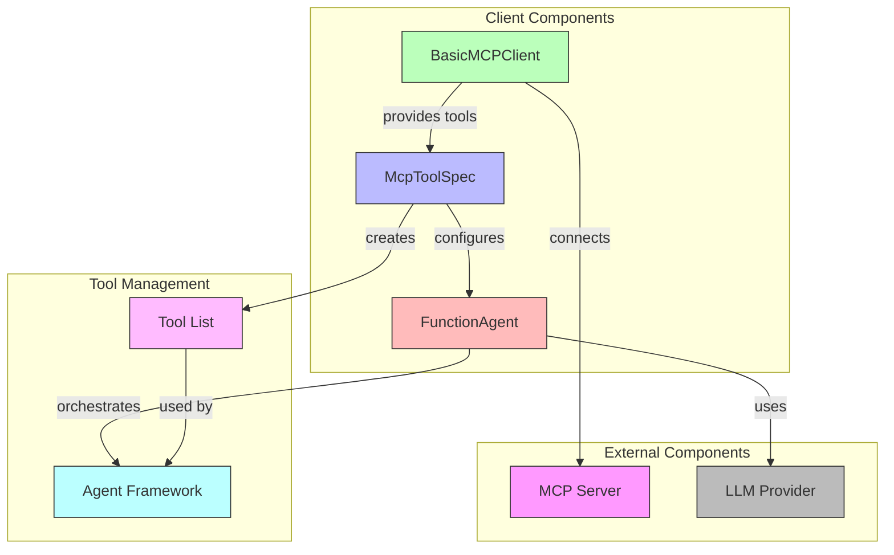
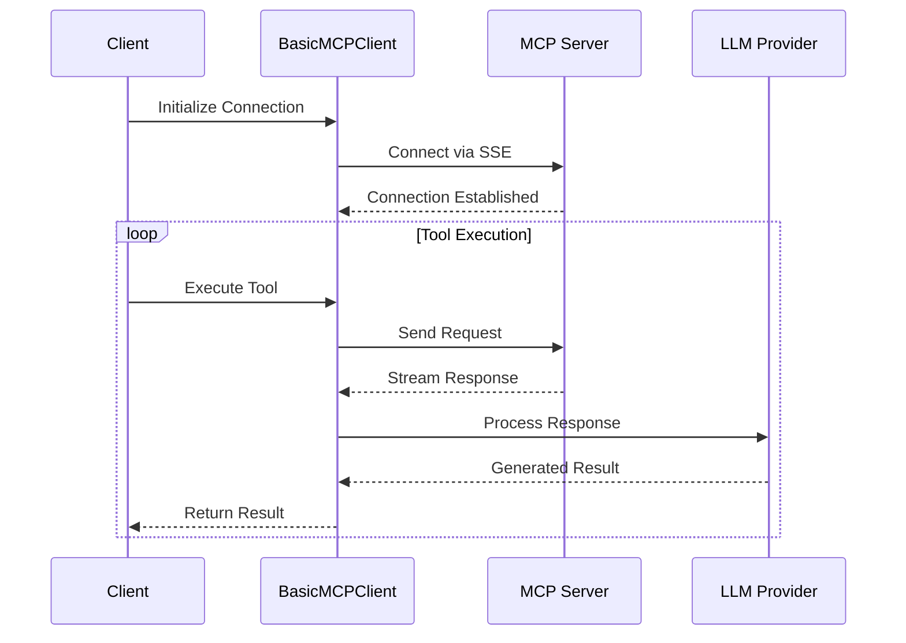

# [ADR-0002] MCP Client Implementation Using LlamaIndex

## Status

Accepted

## Context

The project needs a way to consume Model Context Protocol (MCP) services and integrate them with LLM-powered agents. Requirements include:
- Ability to connect to MCP servers
- Integration with LlamaIndex's agent framework
- Support for asynchronous operations
- Flexible tool specification and filtering
- Clean integration with OpenAI and other LLMs

## Architecture Diagrams

### Client Component Architecture

### Async Operation Flow

## Decision

We have decided to implement the MCP client using LlamaIndex's tools and agent framework with the following components:

1. MCP Client:
   - Using `BasicMCPClient` for server connection
   - Supporting SSE (Server-Sent Events) for real-time communication
   - Implementing asynchronous operations using `asyncio`

2. Tool Integration:
   - Using `McpToolSpec` for tool specification
   - Supporting tool filtering through `allowed_tools`
   - Converting MCP tools to LlamaIndex-compatible format

3. Agent Implementation:
   - Using `FunctionAgent` for tool orchestration
   - Integrating with OpenAI's GPT models
   - Supporting custom system prompts for specialized behavior

## Consequences

### Positive

- Seamless integration with LlamaIndex's ecosystem
- Support for asynchronous operations
- Flexible tool filtering and specification
- Clean integration with various LLM providers
- Reusable agent architecture

### Negative

- Dependency on specific LlamaIndex versions
- Requires understanding of async/await patterns
- Limited to tools exposed by MCP server

### Neutral

- Need to maintain compatibility with LlamaIndex API changes
- Configuration required for different LLM providers

## Related Decisions

- [ADR-0001] Using LlamaCloud as an MCP Server
- [ADR-0003] Transport Protocol Selection

## Notes

The implementation is demonstrated in `mcp-client.py`. The client supports customization through tool filtering and system prompts, making it adaptable to various use cases. 