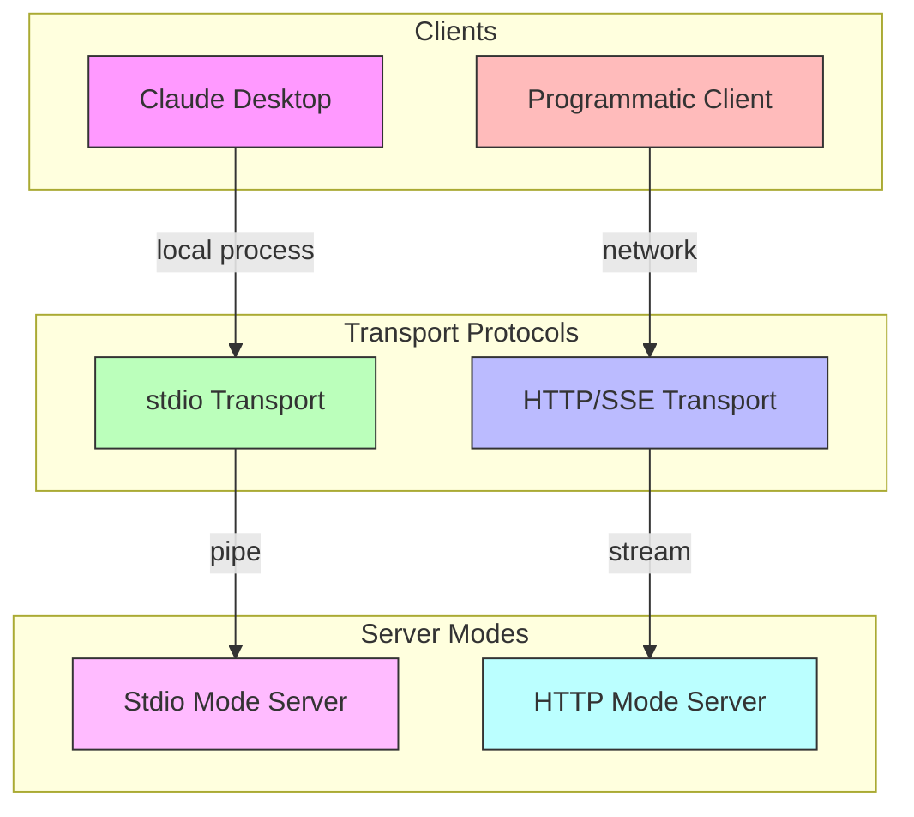
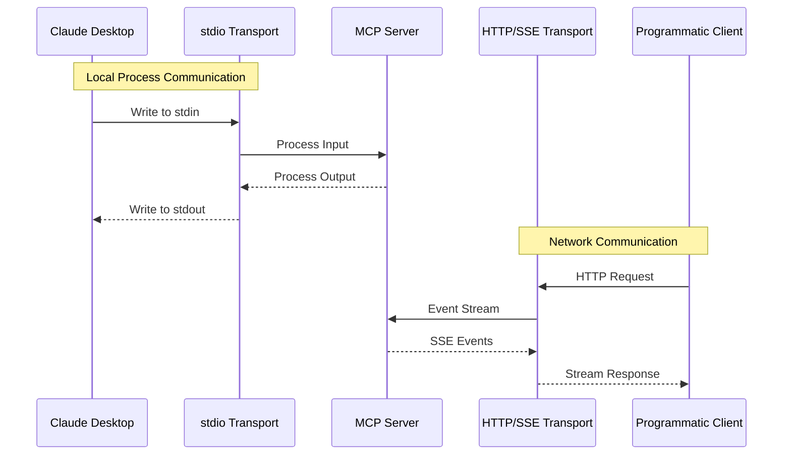

# [ADR-0003] Transport Protocol Selection for MCP Communication

## Status

Accepted

## Context

The project needs to support communication between Model Context Protocol (MCP) servers and various clients, including Claude Desktop and programmatic clients. The transport protocol needs to:
- Support real-time communication
- Work with different client types
- Handle streaming responses
- Be reliable and efficient
- Support both local and network communication

## Architecture Diagrams

### Protocol Selection Architecture

### Communication Patterns

## Decision

We have decided to implement dual transport protocol support:

1. stdio Transport:
   - Used for Claude Desktop integration
   - Direct process communication
   - Synchronous operation
   - Implemented in `mcp-server.py`

2. HTTP/SSE Transport:
   - Used for programmatic clients
   - Server-Sent Events for real-time communication
   - Asynchronous operation
   - Implemented in `mcp-http-server.py`

The selection between protocols is made at server startup:
- stdio: `mcp.run(transport="stdio")`
- HTTP/SSE: `mcp.run_sse_async()`

## Consequences

### Positive

- Flexible integration options for different client types
- Real-time communication support through SSE
- Simple local integration through stdio
- Support for both synchronous and asynchronous patterns
- Clean separation between transport concerns

### Negative

- Increased complexity in server implementation
- Need to maintain two transport paths
- Different error handling for each transport
- Port management needed for HTTP/SSE

### Neutral

- Protocol selection must be made at startup
- Different configuration requirements for each transport
- Need to document both integration patterns

## Related Decisions

- [ADR-0001] Using LlamaCloud as an MCP Server
- [ADR-0002] MCP Client Implementation

## Notes

The transport protocol implementation is split between `mcp-server.py` (stdio) and `mcp-http-server.py` (HTTP/SSE). Configuration for Claude Desktop is provided in `claude_desktop_config.json`. 