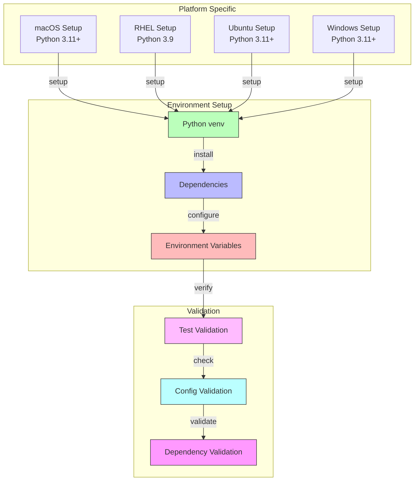
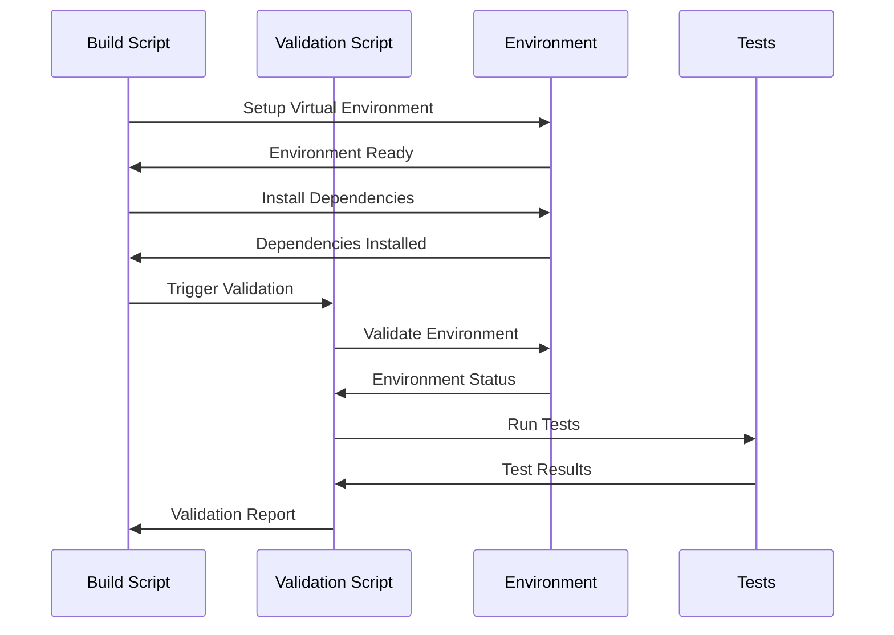

# [ADR-0004] Cross-Platform Build and Validation Strategy

## Status

Accepted

## Context

The project needs to support deployment across multiple platforms (macOS, RHEL 9.5, Ubuntu, Windows) while ensuring consistent behavior and dependencies. Requirements include:
- Platform-specific Python version support:
  - RHEL 9.5: Python 3.9 (default system Python)
  - Other platforms: Python 3.11+
- Dependency management
- Platform-specific considerations
- Build validation
- Environment validation

## Architecture Diagrams

### Build Process Flow



### Validation Process



## Decision

We have decided to implement a standardized build and validation strategy with the following components:

1. Platform-Specific Build Scripts:
   ```bash
   # macOS (build_macos.sh)
   #!/bin/bash
   python3.11 -m venv venv
   source venv/bin/activate
   pip install --upgrade pip
   pip install poetry
   poetry install
   cp .env.example .env
   
   # RHEL 9.5 (build_rhel.sh)
   #!/bin/bash
   sudo dnf install python3 python3-devel
   python3.9 -m venv venv
   source venv/bin/activate
   pip install --upgrade pip
   pip install poetry
   poetry env use python3.9
   poetry install
   cp .env.example .env
   
   # Ubuntu (build_ubuntu.sh)
   #!/bin/bash
   sudo add-apt-repository ppa:deadsnakes/ppa
   sudo apt-get update
   sudo apt-get install python3.11 python3.11-venv python3.11-dev
   python3.11 -m venv venv
   source venv/bin/activate
   pip install --upgrade pip
   pip install poetry
   poetry install
   cp .env.example .env
   
   # Windows (build_windows.ps1)
   python -m venv venv
   .\venv\Scripts\Activate.ps1
   pip install --upgrade pip
   pip install poetry
   poetry install
   Copy-Item .env.example .env
   ```

2. Validation Script:
   ```python
   # validate.py
   def validate_python_version():
       system = platform.system().lower()
       
       if system == 'linux':
           # Check if we're on RHEL
           if 'rhel' in distro.id() or 'red hat' in distro.id():
               if sys.version_info < (3, 9):
                   raise RuntimeError("Python 3.9+ is required for RHEL")
               return
       
       # For all other systems, require Python 3.11+
       if sys.version_info < (3, 11):
           raise RuntimeError("Python 3.11+ is required")
   ```

3. Environment Template:
   ```env
   # .env.example
   LLAMA_CLOUD_API_KEY=your_llama_cloud_api_key
   OPENAI_API_KEY=your_openai_api_key
   ```

## Consequences

### Positive

- Consistent build process across platforms
- Automated validation of environment and dependencies
- Clear error reporting for missing requirements
- Easy setup for new developers
- Platform-specific optimizations
- Support for RHEL 9.5's default Python version

### Negative

- Need to maintain multiple build scripts
- Platform-specific dependencies management
- Different Python version requirements per platform
- Windows-specific path handling required
- Need to ensure compatibility with Python 3.9 on RHEL

### Neutral

- Regular updates needed for dependency versions
- Platform-specific documentation required
- Different shell environments to support
- Need to test compatibility across Python versions

## Related Decisions

- [ADR-0001] Using LlamaCloud as an MCP Server
- [ADR-0002] MCP Client Implementation
- [ADR-0003] Transport Protocol Selection

## Notes

The build and validation scripts should be placed in a `scripts` directory. Each platform's build script should be documented in the README.md with specific instructions for that platform. Special attention should be paid to RHEL 9.5's Python 3.9 requirement versus Python 3.11+ on other platforms. 