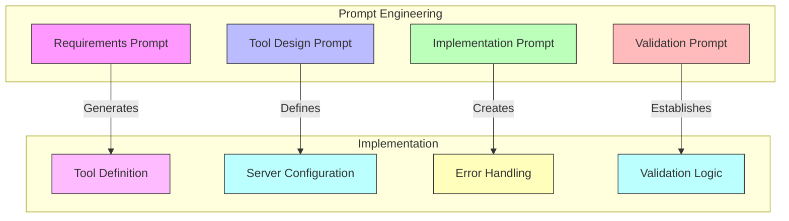
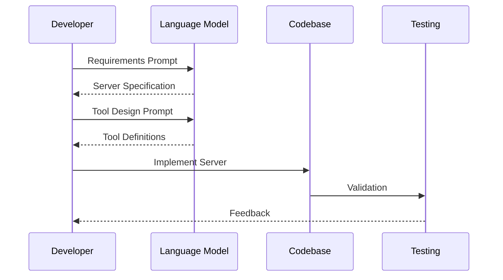

# [ADR-0005] MCP Server Prompt Engineering Strategy

## Status

Accepted

## Context

Creating custom MCP servers requires a structured approach to:
- Define the server's purpose and capabilities
- Design appropriate tools and their interfaces
- Implement proper error handling and validation
- Ensure security and performance
- Maintain consistency across implementations

We need a standardized prompt engineering strategy to help developers create custom MCP servers efficiently and effectively.

## Architecture Diagrams

### Prompt-to-Implementation Flow



### MCP Server Generation Process



## Decision

We will implement a structured prompt engineering strategy with the following components:

### 1. Requirements Analysis Prompt Template
```markdown
Create an MCP server for [domain/purpose] that will:
1. Purpose:
   - Primary function: [describe main functionality]
   - Target users: [describe who will use this]
   - Integration points: [list systems to integrate with]

2. Core Requirements:
   - Data sources: [list data sources]
   - Processing needs: [describe processing requirements]
   - Output formats: [specify required outputs]

3. Security Requirements:
   - Authentication: [describe auth needs]
   - Data privacy: [specify privacy requirements]
   - Access control: [define access levels]

4. Performance Requirements:
   - Response time: [specify timing needs]
   - Throughput: [specify capacity needs]
   - Resource constraints: [list any limitations]
```

### 2. Tool Design Prompt Template
```markdown
Design MCP tools for the [server name] that will:

1. Tool Specifications:
   For each tool, define:
   - Name and purpose
   - Input parameters and types
   - Output format and type
   - Error handling approach
   - Example usage

2. Integration Requirements:
   - External API dependencies
   - Data source connections
   - Authentication methods
   - Rate limiting considerations

3. Implementation Details:
   - Required libraries
   - Environment variables
   - Configuration settings
   - Performance optimizations
```

### 3. Implementation Prompt Template
```markdown
Using the LlamaCloud MCP base code, implement [server name] with:

1. Server Configuration:
```python
from mcp.server.fastmcp import FastMCP
mcp = FastMCP('[server-name]')

# Tool implementations
@mcp.tool()
def [tool_name](param1: type1, param2: type2) -> return_type:
    """[tool description]"""
    # Implementation
    pass
```

2. Required Components:
   - Error handling
   - Input validation
   - Response formatting
   - Logging
   - Performance monitoring

3. Integration Code:
   - API client setup
   - Authentication handling
   - Rate limiting
   - Connection pooling
```

### 4. Validation Prompt Template
```markdown
Create validation tests for [server name] that verify:

1. Functional Requirements:
   - Tool behavior
   - Input handling
   - Output formatting
   - Error scenarios

2. Performance Requirements:
   - Response times
   - Resource usage
   - Concurrent requests
   - Rate limiting

3. Integration Tests:
   - API connectivity
   - Authentication
   - Data consistency
   - Error handling
```

## Example End-to-End Implementation

### 1. Requirements Phase
```markdown
Create an MCP server for a technical documentation search system that will:
1. Purpose:
   - Primary function: Search and retrieve technical documentation
   - Target users: Development teams, technical writers
   - Integration: Git repositories, documentation platforms

2. Core Requirements:
   - Data sources: Git repos, Markdown files, API docs
   - Processing: Full-text search, semantic search
   - Output: Markdown-formatted responses with code examples
```

### 2. Tool Design Phase
```python
@mcp.tool()
def search_technical_docs(query: str, doc_type: str = None) -> str:
    """Search technical documentation with optional type filter."""
    index = LlamaCloudIndex(
        name="tech-docs",
        project_name="Documentation",
        organization_id=os.getenv("LLAMA_CLOUD_ORG_ID"),
    )
    
    query_text = f"Search for: {query}"
    if doc_type:
        query_text += f" in {doc_type} documentation"
    
    return str(index.as_query_engine().query(query_text))

@mcp.tool()
def get_code_examples(language: str, concept: str) -> str:
    """Retrieve code examples for a specific concept."""
    index = LlamaCloudIndex(
        name="code-examples",
        project_name="Documentation",
    )
    
    query = f"Find code examples in {language} for {concept}"
    return str(index.as_query_engine().query(query))
```

### 3. Implementation Phase
```python
import logging
from typing import Optional
from pydantic import BaseModel, Field

class SearchRequest(BaseModel):
    query: str = Field(..., description="Search query")
    doc_type: Optional[str] = Field(None, description="Documentation type")

@mcp.tool()
def enhanced_doc_search(request: SearchRequest) -> str:
    """Enhanced documentation search with validation and error handling."""
    try:
        logging.info(f"Searching docs: {request.query}")
        result = search_technical_docs(request.query, request.doc_type)
        return format_response(result)
    except Exception as e:
        logging.error(f"Search failed: {e}")
        return f"Error performing search: {str(e)}"

def format_response(result: str) -> str:
    """Format the search response with proper markdown."""
    return f"""
## Search Results

{result}

---
*Generated by Technical Documentation MCP Server*
"""
```

### 4. Validation Phase
```python
import pytest
from your_mcp_server import enhanced_doc_search

def test_doc_search():
    request = SearchRequest(query="authentication", doc_type="API")
    result = enhanced_doc_search(request)
    assert "## Search Results" in result
    assert len(result) > 0

def test_error_handling():
    request = SearchRequest(query="", doc_type="invalid")
    result = enhanced_doc_search(request)
    assert "Error" in result
```

## Consequences

### Positive
- Standardized approach to creating MCP servers
- Clear separation of concerns
- Consistent documentation and implementation
- Reusable prompt templates
- Built-in validation and testing

### Negative
- Additional upfront planning required
- Need to maintain prompt templates
- May require prompt adjustments for specific use cases

### Neutral
- Regular updates to prompt templates needed
- Different LLMs may require prompt adjustments
- Need to balance flexibility and standardization

## Related Decisions
- [ADR-0001] Using LlamaCloud as an MCP Server
- [ADR-0002] MCP Client Implementation
- [ADR-0004] Build and Validation Strategy

## Notes
The prompt templates should be regularly reviewed and updated based on:
- New use cases and requirements
- LLM capabilities and limitations
- Best practices in MCP server development
- Security considerations
- Performance optimizations 