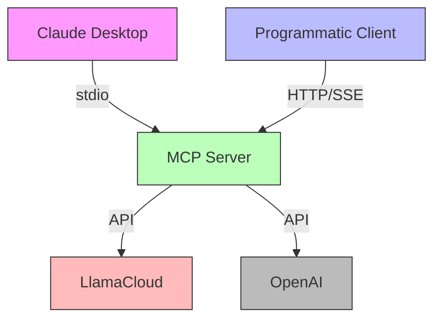
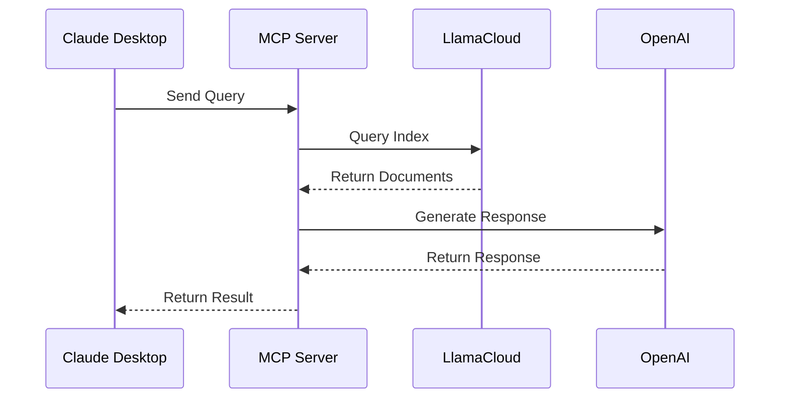
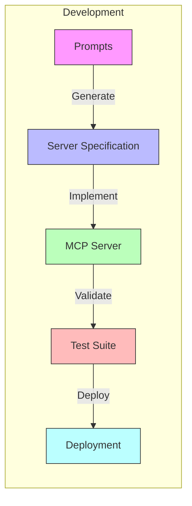

# Architecture Decision Records (ADRs)

## Overview

This directory contains Architecture Decision Records (ADRs) for the LlamaCloud Model Context Protocol (MCP) project. Each ADR documents a significant architectural decision, including the context, consequences, and rationale behind the decision.

## Categories

### Core Architecture
- [[ADR-0001] Using LlamaCloud as an MCP Server](0001-llamacloud-mcp-server.md)
  - Foundation of the MCP server implementation
  - Integration with LlamaCloud for RAG capabilities
  - Environment configuration decisions

### Integration Patterns
- [[ADR-0002] MCP Client Implementation Using LlamaIndex](0002-mcp-client-implementation.md)
  - Client-side integration with LlamaIndex
  - Agent framework implementation
  - Tool specification and filtering

### Communication Protocols
- [[ADR-0003] Transport Protocol Selection](0003-transport-protocol-selection.md)
  - Dual transport protocol support (stdio and HTTP/SSE)
  - Protocol selection and configuration
  - Client communication patterns

### Build and Deployment
- [[ADR-0004] Cross-Platform Build and Validation Strategy](0004-build-and-validation.md)
  - Build scripts for multiple platforms
  - Validation framework
  - Environment setup and configuration

### Development Workflow
- [[ADR-0005] MCP Server Prompt Engineering Strategy](0005-mcp-server-prompt-engineering.md)
  - Prompt templates for server creation
  - End-to-end implementation examples
  - Validation and testing approach

### Templates
- [[ADR-0000] ADR Template](0000-adr-template.md)
  - Standard template for creating new ADRs

## Architectural Diagrams

### System Context Diagram

### Component Interaction Diagram

### Development Process Flow

## Status Legend

- **Proposed**: Initial proposal, under discussion
- **Accepted**: Decision has been accepted and implemented
- **Deprecated**: Decision is no longer valid but preserved for historical context
- **Superseded**: Decision has been replaced by a newer decision

## Contributing

When adding a new ADR:
1. Copy the template from [ADR-0000]
2. Create a new file with the next available number
3. Fill in all sections of the template
4. Add the ADR to this index under the appropriate category
5. Update any related ADRs' "Related Decisions" sections 