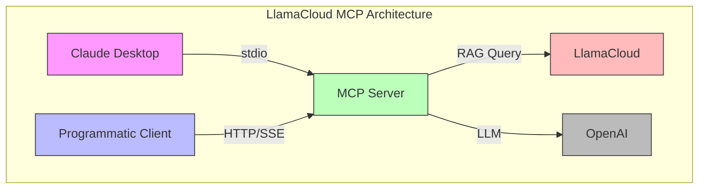

# Building a LlamaCloud-Powered MCP Server: From RAG to Production

## Introduction

Model Context Protocol (MCP) is an open standard introduced by Anthropic that enables AI systems (like large language models) to connect and interact with external tools, data sources, and services. This guide demonstrates how we've implemented an MCP server using LlamaCloud's RAG capabilities to provide AI assistants with real-time access to documentation and data.

## Table of Contents

1. [Understanding Our MCP Architecture](#understanding-our-mcp-architecture)
2. [Setting Up the LlamaCloud Environment](#setting-up-the-llamacloud-environment)
3. [Implementing Core MCP Tools](#implementing-core-mcp-tools)
4. [Advanced RAG Integration](#advanced-rag-integration)
5. [Deployment and Usage](#deployment-and-usage)

## Understanding Our MCP Architecture

Our MCP server implementation is built on LlamaCloud and follows a carefully designed architecture:



## Setting Up the LlamaCloud Environment

1. First, set up your LlamaCloud account and create an index:
```bash
# Clone the repository
git clone https://github.com/yourusername/llamacloud-mcp
cd llamacloud-mcp

# Create environment file
cp .env.example .env

# Add your API keys
echo "LLAMA_CLOUD_API_KEY=your_key_here" >> .env
echo "OPENAI_API_KEY=your_key_here" >> .env
```

2. Install dependencies based on your platform:
```bash
# For RHEL 9.5
./scripts/build_rhel.sh

# For Ubuntu
./scripts/build_ubuntu.sh

# For macOS
./scripts/build_macos.sh

# For Windows
./scripts/build_windows.ps1
```

## Implementing Core MCP Tools

Our MCP server provides several key tools for documentation and data access:

### 1. Documentation Search Tool

```python
@mcp.tool()
def llama_index_documentation(query: str) -> str:
    """Search the llama-index documentation for the given query."""
    index = LlamaCloudIndex(
        name="mcp-demo-2",
        project_name="Rando project",
        organization_id="e793a802-cb91-4e6a-bd49-61d0ba2ac5f9",
        api_key=os.getenv("LLAMA_CLOUD_API_KEY"),
    )
    
    response = index.as_query_engine().query(
        query + " Be verbose and include code examples."
    )
    return str(response)
```

### 2. Using the Tool with Claude Desktop

1. Configure Claude Desktop:
```json
{
    "mcpServers": {
        "llama_index_docs_server": {
            "command": "poetry",
            "args": [
                "--directory",
                "$YOURPATH/llamacloud-mcp",
                "run",
                "python",
                "$YOURPATH/llamacloud-mcp/mcp-server.py"
            ]
        }
    }
}
```

2. Example queries:
```
User: How do I use LlamaIndex with RAG?
Assistant: Let me search the documentation for information about RAG in LlamaIndex.

[Tool calls llama_index_documentation with query]

Based on the documentation...
```

## Advanced RAG Integration

Our implementation leverages LlamaCloud's advanced RAG capabilities:

### 1. HTTP/SSE Server for Programmatic Access

```python
# mcp-http-server.py
mcp = FastMCP('llama-index-server', port=8000)

@mcp.tool()
async def query_with_rag(
    query: str,
    index_name: str,
    response_mode: str = "compact"
) -> str:
    """
    Query documents using RAG with customizable response modes.
    
    Args:
        query: The search query
        index_name: Name of the LlamaCloud index to query
        response_mode: Response format (compact/detailed)
    """
    index = LlamaCloudIndex(
        name=index_name,
        api_key=os.getenv("LLAMA_CLOUD_API_KEY"),
    )
    
    response = index.as_query_engine(
        response_mode=response_mode
    ).query(query)
    
    return str(response)

asyncio.run(mcp.run_sse_async())
```

### 2. LlamaIndex Client Integration

```python
from llama_index import ServiceContext
from llama_index.llms import OpenAI

# Initialize LlamaIndex client
mcp_client = BasicMCPClient("http://localhost:8000/sse")
mcp_tool_spec = McpToolSpec(client=mcp_client)
tools = mcp_tool_spec.to_tool_list()

# Create an agent
llm = OpenAI(model="gpt-4")
agent = FunctionAgent(
    tools=tools,
    llm=llm,
    system_prompt="You are an agent that helps users find information in documentation.",
)

# Example usage
async def search_docs():
    response = await agent.run(
        "Find information about RAG implementation patterns"
    )
    print(response)
```

## Deployment and Usage

1. Start the server:
```bash
# For Claude Desktop
poetry run python mcp-server.py

# For HTTP/SSE clients
poetry run python mcp-http-server.py
```

2. Validate the setup:
```bash
poetry run python scripts/validate.py
```

3. Monitor the server:
```bash
# Check logs
tail -f logs/mcp-server.log

# Monitor performance
poetry run python scripts/monitor.py
```

## Best Practices from Our Implementation

1. **RAG Configuration**
   - Use appropriate chunk sizes for your content
   - Configure embedding models based on your use case
   - Implement caching for frequently accessed content

2. **Error Handling**
   - Implement retries for LlamaCloud API calls
   - Provide informative error messages
   - Handle rate limiting gracefully

3. **Security**
   - Store API keys securely
   - Implement authentication for HTTP endpoints
   - Validate all input queries

## Conclusion

Our LlamaCloud-powered MCP server provides a robust foundation for AI-powered documentation search and RAG capabilities. By following our architectural decisions and implementation patterns, you can build similar systems that leverage LlamaCloud's powerful features.

For more detailed information, refer to our ADRs:
- [ADR-0001: Using LlamaCloud as an MCP Server](../docs/adrs/0001-llamacloud-mcp-server.md)
- [ADR-0002: MCP Client Implementation](../docs/adrs/0002-mcp-client-implementation.md)
- [ADR-0003: Transport Protocol Selection](../docs/adrs/0003-transport-protocol-selection.md)
- [ADR-0004: Cross-Platform Build and Validation Strategy](../docs/adrs/0004-build-and-validation.md)
- [ADR-0005: Custom MCP Server Development](../docs/adrs/0005-mcp-server-prompt-engineering.md)

Remember to check our [GitHub repository](https://github.com/tosin2013/llamacloud-mcp) for the latest updates and examples. 