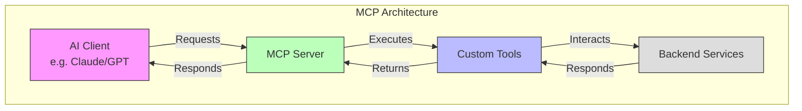

# Building Your Own Custom MCP Server: A Comprehensive Guide

## Introduction

Machine Callable Programs (MCPs) are revolutionizing how we build AI-powered applications by providing a standardized way for AI models to interact with tools and services. In this guide, we'll walk through the process of building your own custom MCP server, using our architectural decisions and real-world examples as a foundation.

## Table of Contents

1. [Understanding MCP Architecture](#understanding-mcp-architecture)
2. [Setting Up Your Development Environment](#setting-up-your-development-environment)
3. [Building Your First MCP Server](#building-your-first-mcp-server)
4. [Advanced Use Cases](#advanced-use-cases)
5. [Best Practices and Tips](#best-practices-and-tips)

## Understanding MCP Architecture

Before diving into implementation, let's understand the core architecture of our MCP system:



Our architecture is based on several key decisions documented in our ADRs:
- Transport protocols (stdio/HTTP/SSE) for client communication
- Tool implementation patterns
- Error handling and validation
- Cross-platform compatibility

## Setting Up Your Development Environment

### Prerequisites

1. Python 3.9+ (RHEL) or Python 3.11+ (other platforms)
2. Poetry for dependency management
3. Your favorite IDE/text editor

### Initial Setup

1. Create your project structure:
```bash
mkdir my-mcp-server
cd my-mcp-server
poetry init
```

2. Add required dependencies:
```bash
poetry add fastmcp llama-index python-dotenv
```

3. Create your environment file:
```bash
cp .env.example .env
```

## Building Your First MCP Server

Let's create a simple MCP server that generates code based on natural language descriptions.

### 1. Basic Server Setup

Create `server.py`:

```python
from fastmcp import FastMCP
import os
from dotenv import load_dotenv
from typing import Dict, List

# Load environment variables
load_dotenv()

# Initialize MCP server
mcp = FastMCP('code-generator-server')

@mcp.tool()
def generate_python_class(
    class_name: str,
    attributes: List[str],
    methods: List[Dict[str, str]]
) -> str:
    """
    Generate a Python class based on specifications.
    
    Args:
        class_name: Name of the class
        attributes: List of class attributes
        methods: List of method specifications
    
    Returns:
        str: Generated Python class code
    """
    # Build class definition
    code = f"class {class_name}:\n"
    
    # Add docstring
    code += "    \"\"\"A generated Python class.\"\"\"\n\n"
    
    # Add constructor
    code += "    def __init__(self"
    for attr in attributes:
        code += f", {attr}"
    code += "):\n"
    
    # Add attribute assignments
    for attr in attributes:
        code += f"        self.{attr} = {attr}\n"
    
    # Add methods
    for method in methods:
        code += f"\n    def {method['name']}(self"
        if 'params' in method:
            code += f", {method['params']}"
        code += "):\n"
        code += f"        \"\"\"{method.get('description', '')}\"\"\"\n"
        code += f"        {method.get('body', 'pass')}\n"
    
    return code

if __name__ == "__main__":
    mcp.run(transport="stdio")  # For Claude Desktop
    # For HTTP/SSE: mcp.run_sse_async(port=8000)
```

### 2. Example Usage

Here's how to use the code generation tool:

```python
# Example input for generating a User class
class_spec = {
    "class_name": "User",
    "attributes": ["username", "email", "password"],
    "methods": [
        {
            "name": "authenticate",
            "params": "password: str",
            "description": "Authenticate the user with a password",
            "body": "return self.password == password"
        },
        {
            "name": "update_email",
            "params": "new_email: str",
            "description": "Update the user's email address",
            "body": "self.email = new_email"
        }
    ]
}

# The tool will generate:
"""
class User:
    \"\"\"A generated Python class.\"\"\"

    def __init__(self, username, email, password):
        self.username = username
        self.email = email
        self.password = password

    def authenticate(self, password: str):
        \"\"\"Authenticate the user with a password\"\"\"
        return self.password == password

    def update_email(self, new_email: str):
        \"\"\"Update the user's email address\"\"\"
        self.email = new_email
"""
```

## Advanced Use Cases

### 1. RAG-Enhanced Code Generation

Let's create a more sophisticated tool that uses RAG (Retrieval-Augmented Generation) to generate code based on documentation and examples:

```python
from llama_index import VectorStoreIndex, Document
from typing import Optional

@mcp.tool()
async def generate_with_examples(
    description: str,
    language: str,
    similar_examples: Optional[int] = 3
) -> str:
    """
    Generate code using RAG to find similar examples.
    
    Args:
        description: Natural language description of the code to generate
        language: Programming language to generate
        similar_examples: Number of similar examples to consider
    """
    # Create an index of code examples
    documents = [
        Document(text=example.code, metadata={"language": example.language})
        for example in code_examples_db.get_examples()
    ]
    index = VectorStoreIndex.from_documents(documents)
    
    # Query similar examples
    query_engine = index.as_query_engine()
    similar = query_engine.query(
        f"Find examples of {language} code that do: {description}"
    )
    
    # Generate new code based on examples and description
    prompt = f"""
    Description: {description}
    Language: {language}
    Similar examples:
    {similar.response}
    
    Generate new code based on these examples and requirements.
    """
    
    response = llm.complete(prompt)
    return response.text
```

### 2. Interactive Code Review Tool

```python
@mcp.tool()
async def review_code(code: str, focus_areas: List[str]) -> Dict[str, List[str]]:
    """
    Perform an automated code review.
    
    Args:
        code: Source code to review
        focus_areas: Specific areas to focus on (e.g., ["security", "performance"])
    """
    reviews = {}
    
    for area in focus_areas:
        prompt = f"""
        Review the following code focusing on {area}:
        
        {code}
        
        Provide specific suggestions for improvement.
        """
        
        response = llm.complete(prompt)
        reviews[area] = parse_suggestions(response.text)
    
    return reviews
```

## Best Practices and Tips

1. **Error Handling**
   - Always validate input parameters
   - Provide clear error messages
   - Handle edge cases gracefully

```python
from typing import Optional, Dict, Any
from pydantic import BaseModel, validator

class CodeGenRequest(BaseModel):
    description: str
    language: str
    timeout: Optional[int] = 30
    
    @validator('language')
    def validate_language(cls, v):
        supported = ['python', 'javascript', 'typescript', 'java']
        if v.lower() not in supported:
            raise ValueError(f"Language must be one of: {supported}")
        return v.lower()

@mcp.tool()
async def safe_generate_code(request: CodeGenRequest) -> Dict[str, Any]:
    try:
        code = await generate_with_timeout(
            request.description,
            request.language,
            timeout=request.timeout
        )
        return {"success": True, "code": code}
    except TimeoutError:
        return {
            "success": False,
            "error": "Generation timed out",
            "partial_result": None
        }
    except Exception as e:
        return {
            "success": False,
            "error": str(e),
            "partial_result": None
        }
```

2. **Performance Optimization**
   - Cache frequently used results
   - Use async/await for I/O operations
   - Implement rate limiting for external services

3. **Security Considerations**
   - Validate and sanitize all inputs
   - Use environment variables for sensitive data
   - Implement proper authentication/authorization
   - Sanitize generated code output

## Conclusion

Building a custom MCP server opens up powerful possibilities for AI-powered development tools. By following this guide and our architectural decisions, you can create robust, scalable, and secure MCP servers that enhance your development workflow.

For more detailed information, refer to our ADRs:
- [ADR-0001: Using LlamaCloud as an MCP Server](../docs/adrs/0001-llamacloud-mcp-server.md)
- [ADR-0002: MCP Client Implementation](../docs/adrs/0002-mcp-client-implementation.md)
- [ADR-0003: Transport Protocol Selection](../docs/adrs/0003-transport-protocol-selection.md)
- [ADR-0004: Cross-Platform Build and Validation Strategy](../docs/adrs/0004-build-and-validation.md)
- [ADR-0005: Custom MCP Server Development](../docs/adrs/0005-mcp-server-prompt-engineering.md)

Remember to check our [GitHub repository](https://github.com/tosin2013/llamacloud-mcp) for the latest updates and examples. 